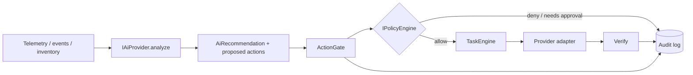

# AI architecture and safety

## Principles

* AI is an **infrastructure reasoning layer**, not the telemetry engine: deterministic rules and statistics handle high-volume signals; an LLM investigates, explains, plans and converses.
* The AI provider is **model-agnostic and pluggable** (`IAiProvider`); local/self-hosted runtimes (Ollama, vLLM, llama.cpp, ...) are first-class, cloud models optional. Nothing in the core names a model or runtime.
* **The AI never has infrastructure control.** See below and [ADR 0007](../../adrs/0007-ai-safety-and-control-flow.md).

## Control flow (implemented)

* `IAiProvider` has one method, `analyze(AiRequest) → AiRecommendation`. It returns data. There is no execute/call-tool method to misuse.
* An `AiRecommendation` is **not** an action. To be executed, a draft must be turned into a `ProposedAction` (with the proposer's identity, `ActorKind::Ai`) and submitted to the **`ActionGate`**.
* The gate: (1) denies unregistered action types (only actions that have a `TaskFactory` can ever run), (2) asks the `IPolicyEngine` (**default: `DenyAllPolicy`**), (3) on `Allow` only, creates a task attributed to the proposer, (4) audits every decision — allow, deny, require-approval, unknown action, factory failure — and publishes `ActionDecided`.
* Self-reported `confidence` can be a *gate* in a rule (e.g. ≥ 0.85) but never *authorization*: a rule must explicitly allow that action type for that actor kind.
* `RuleBasedPolicy` is deterministic (action type, actor kinds, required roles, confidence threshold; first match wins; no match = deny).

Tests: `tests/unit/test_policy.cpp`, `Simulation.AiRecommendationReachesInfrastructureOnlyThroughPolicyAndTasks`.

## Modes

| Mode | Behaviour |
|---|---|
| Advisor (default) | AI observes, analyses, recommends; humans act |
| Controlled autonomous | Only actions explicitly allowed by policy run automatically — the policy engine, not the model, decides |

## Not yet

Real models, tool-use over read-only inventory/telemetry, evidence-grounded reports, an evaluation
harness (context §32.6), approval workflow, RBAC-backed identity. Prompt-injection hardening is a
requirement for the first real AI provider: model output and any data it ingested are untrusted input.
