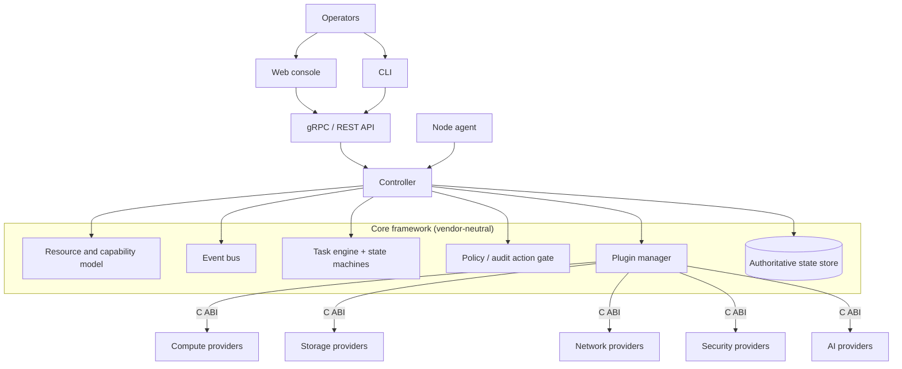

# Architecture overview

## Layers

1. **Presentation** — web console, CLI. Consume the API only.
2. **Management/API** — gRPC/Protobuf contracts ([API](api.md)), authn/authz, audit.
3. **Core framework** (`include/karevona`, `core/`) — resource model, capabilities, events, tasks, state machines, plugin manager, policy gate, persistence abstraction, config/logging/metrics ([framework](framework.md)).
4. **Providers/plugins** — hypervisors, storage, networks, scanners, backup, AI models, behind a C ABI ([plugins](plugins.md)).
5. **Node/data plane** — QEMU/KVM, storage backends, Linux networking. The node agent runs close to the host kernel; it is not assumed to be containerised in production.
6. **Observability/security data** — metrics, logs, traces, scanner findings ([observability](observability.md)).

## The five things that must never be conflated

| Concept | Answers | Lives in | Not |
|---|---|---|---|
| **Authoritative state** | "What is true now?" | `IStateStore` ([persistence](persistence.md)) | an event log |
| **Events** | "What happened?" | `IEventBus` ([events](events.md)) | the source of truth |
| **Tasks** | "What must be done?" | `TaskEngine` ([tasks](tasks.md)) | an event |
| **Telemetry** | "What is the system doing?" | time-series/OTel (future) | state |
| **AI recommendations** | "What might help?" | `IAiProvider` ([AI](../ai/overview.md)) | an action |

Infrastructure *actions* occur only inside tasks, after policy.

## Process model

| Process | Directory | Role |
|---|---|---|
| `karevona-controller` | `controller/` | Wires core + serves the gRPC API. `--simulate` loads simulated providers |
| `karevona-node-agent` | `node-agent/` | Per-node component; today reports its architecture only |
| Web console | `web/` | Next.js UI over the API |

## Dependency direction

`web → API contracts → controller → core ← plugins (via C ABI)`. The core
depends on no vendor, on no concrete event transport, no SQL and no AI model
([ADR 0001](../../adrs/0001-framework-core-boundary.md)).
