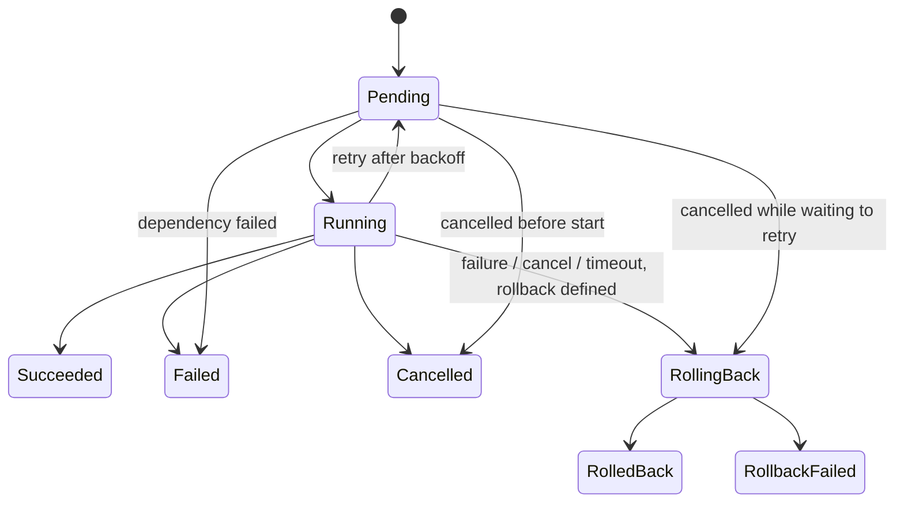

# Tasks and state machines

Everything that mutates infrastructure is a **task** ([ADR 0005](../../adrs/0005-task-engine.md)):
observable, cancellable, retryable and auditable. Providers expose synchronous
primitives; the task engine calls them from task actions.

## TaskSpec

```
type, subject, actor, params (JSON), depends_on[TaskId], retry{max_attempts, initial_backoff, multiplier, max_backoff},
timeout (per attempt), action(TaskContext&)->Status, rollback(TaskContext&)->Status (optional), trace
```

`TaskContext` gives the action its `task_id`, `params`, 1-based `attempt()`,
`report_progress(percent, message)`, `cancelled()` and an interruptible
`sleep_for()`.

## Lifecycle



Terminal: `Succeeded, Failed, Cancelled, RolledBack, RollbackFailed`.
`TaskSnapshot.cause` (`failed | cancelled | timed_out | dependency_failed`)
survives rollback so `RolledBack` still says *why* it was rolled back.
`RollbackFailed` means an operator must intervene.

## Behaviour

| Concern | Behaviour |
|---|---|
| Asynchronous execution | Worker pool (`TaskEngineOptions.workers`); `submit()` returns immediately with a `TaskId` |
| Progress | `report_progress`; visible in `get()` while running |
| Cancellation | `cancel(id)`: never-started tasks are cancelled immediately; running ones are asked to stop and settle when the action returns |
| Timeout | Per attempt, enforced by a watchdog that flips `cancelled()`; a timed-out attempt may be retried |
| Retry | Exponential backoff; **not** retried: `InvalidArgument, FailedPrecondition, PermissionDenied, NotFound, AlreadyExists, Unimplemented, Cancelled` |
| Dependencies | Run after all `depends_on` succeed; if one ends non-successfully the dependent fails with `dependency_failed` without running (transitively) |
| Rollback | Runs after failure, cancellation or timeout when an attempt had started. Rollback itself cannot be cancelled |
| Exceptions | Converted to `Internal` failures |
| Events | Every transition publishes `TaskStateChanged` (ordered; handlers may call back into the engine) |
| Metrics | `karevona_task_transitions_total`, `karevona_task_duration_milliseconds`, `karevona_tasks_submitted_total` |

Limitation: cancellation is cooperative ([framework](framework.md#known-limitations)).

## State machines

`TransitionTable<State>` is an immutable, shared description of legal edges;
`StateMachine<State>` is one instance walking it and recording history. Defined
tables: task, plugin, node, volume, and the VM **migration** workflow
(`Pending → Validating → Preparing → Copying → Switching → Verifying →
Completed`, failures → `Failed → Rollback → Restored`), which the simulation
tests drive end to end.
