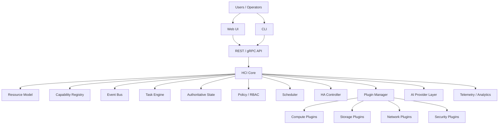
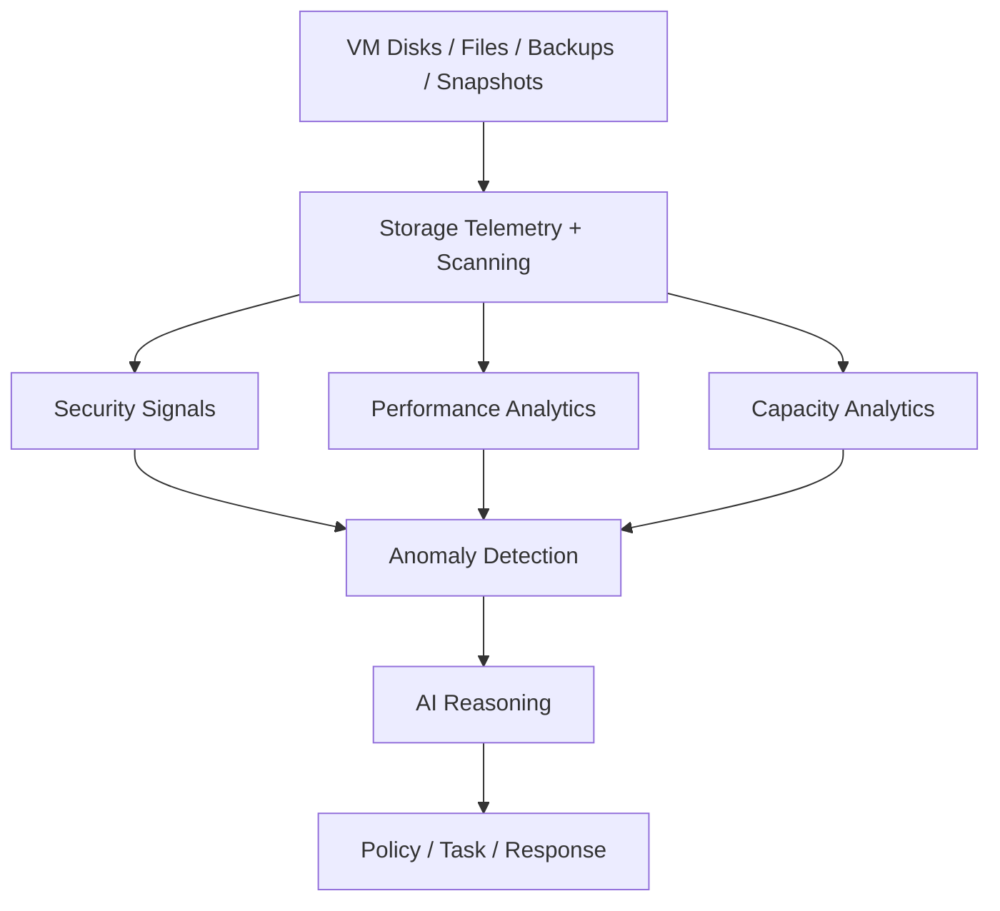
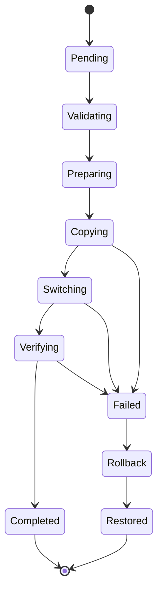
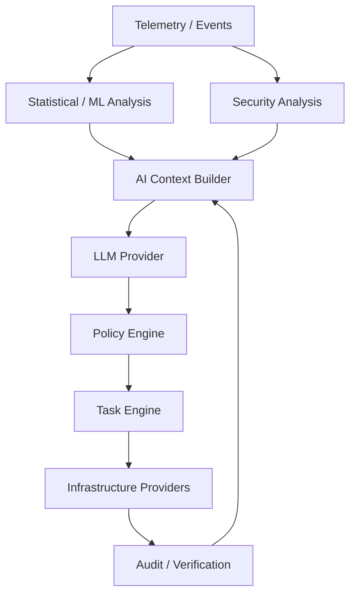
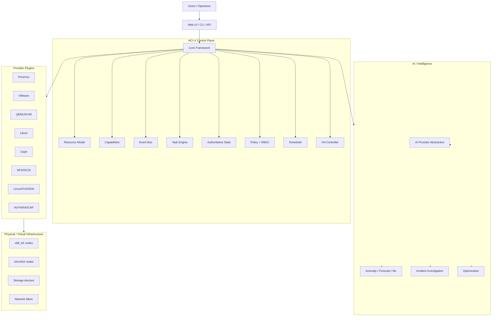

# HCI-X — Full Product Context, Architecture, and Build Specification

> **Purpose:** This document is the consolidated context from the design conversations for the HCI-X project. It is intended to be fed directly into AI coding/design agents such as **Claude Code** and **Claude Design** so they can understand the product vision, architectural decisions, constraints, interfaces, diagrams, schemas, roadmap, and development workflow without repeatedly asking for context.

> **Working name:** HCI-X  
> **Product class:** Modular heterogeneous infrastructure control plane + optional HCI data plane + storage intelligence/security + AI operations layer.  
> **Primary implementation language:** C++ (with C-compatible plugin ABI where appropriate).  
> **Web UI:** Next.js + TypeScript + Material UI (MUI).  
> **Target host architectures:** x86, x86_64/amd64, ARM, AArch64/ARM64.  
> **Development preference:** Host should not need a native C/C++ toolchain; use Docker/dev containers for build/development and CI.

---

## 0. Instructions for AI Agents

Treat this document as the current product context and working specification.

### 0.1 General behavior

- Continue from the architecture and decisions in this document rather than inventing a separate product concept.
- Prefer small, testable increments over a giant implementation.
- Do not rewrite mature infrastructure components when an existing proven component can be integrated through a clean adapter.
- Preserve provider neutrality in the core. Do not leak Proxmox-, VMware-, Ceph-, QEMU-, or other provider-specific concepts into the core resource model unless an abstraction genuinely cannot avoid them.
- Prefer capability-driven behavior over provider-name-driven conditionals.
- Treat authoritative state, events, commands, tasks, and telemetry as different concepts.
- AI must never be able to bypass authentication, authorization, policy, task validation, audit, or execution controls.
- Prefer deterministic rules/statistics/ML for high-volume telemetry and use an LLM for reasoning, investigation, explanation, planning, and operator interaction.
- Keep AI model selection provider-agnostic.
- Keep the event transport provider-agnostic. Kafka is optional, not a core dependency.
- Design for both x86_64 and AArch64 from the beginning, with explicit architecture/capability metadata.
- Native migration is architecture-compatible only unless an explicit conversion/emulation workflow is implemented.
- Use Docker for local development dependencies and reproducible builds.
- Do not require Docker to be the final production architecture of an HCI node when direct host-kernel/device access is required.
- Prefer established libraries and protocols instead of implementing generic infrastructure primitives from scratch.

### 0.2 Autonomy expectation

The intended outcome is that an AI coding/design agent can:

1. Read this file.
2. Inspect the repository.
3. Create/update implementation files and tests.
4. Make reasonable implementation decisions consistent with the architecture.
5. Avoid asking for clarification unless genuinely blocked by missing credentials, destructive production actions, or an architectural contradiction.

### 0.3 Product principle

The product should **not** be positioned as "another Proxmox" or "another CloudStack".

The intended strategic direction is:

> **A vendor-neutral infrastructure control plane that manages heterogeneous existing infrastructure, optionally provides HCI capabilities, and adds storage intelligence, security, analytics, and AI-assisted operations across providers.**

A central commercial theme is:

> **Bring your existing infrastructure first; adopt deeper HCI capabilities incrementally.**

---

# 1. Product Evolution and Strategic Context

The project originally began as a C/C++-based hyperconverged infrastructure platform. The scope then expanded after examining existing products such as Apache CloudStack.

The important realization is that generic infrastructure orchestration is already a mature category. Therefore HCI-X should differentiate by combining:

- brownfield-first heterogeneous infrastructure management;
- a strong provider/plugin abstraction;
- architecture-aware scheduling across x86_64 and ARM64;
- storage-independent VM lifecycle;
- storage intelligence and analytics;
- malware/ransomware-oriented storage security;
- AI-assisted investigation and optimization;
- a modular C++ framework and plugin SDK;
- optional native HCI storage/data-plane capabilities;
- simple deployment and a unified UI over heterogeneous backends.

The product is therefore better thought of as a **universal infrastructure control plane with an optional HCI data plane** rather than just a hypervisor.

---

# 2. High-Level Product Vision

```text
                         HCI-X PLATFORM
                              │
          ┌───────────────────┼───────────────────┐
          │                   │                   │
       CONTROL              DATA                AI
        PLANE               PLANE              PLANE
          │                   │                   │
     API / RBAC          Compute             Reasoning
     Scheduler           Storage             Investigation
     Policy              Network             Optimization
     HA                  Security            Recommendations
     Tasks               Telemetry           Operator Agent
     Audit
          │                   │                   │
          └───────────────────┼───────────────────┘
                              │
                     Heterogeneous Providers
                              │
          ┌───────────────────┼────────────────────┐
          │                   │                    │
       Proxmox              VMware               KVM/QEMU
          │                   │                    │
       x86/ARM              x86_64               x86/ARM64
```

The platform should be able to manage environments such as:

```text
Existing datacenter:

VMware cluster
Proxmox cluster
Standalone QEMU/KVM hosts
ARM64 KVM cluster
Ceph storage
NFS/iSCSI storage
Linux/OVS networking
```

without forcing the customer to migrate everything before getting value.

---

# 3. Main Product Differentiators

## 3.1 Brownfield-first

Do not require replacing existing hypervisors or infrastructure.

Preferred adoption path:

```text
Existing Infrastructure
        ↓
Discover
        ↓
Normalize
        ↓
Observe
        ↓
Apply Policy
        ↓
Optimize
        ↓
Optionally Add Native HCI Capabilities
```

## 3.2 Heterogeneous infrastructure as a first-class concept

A single customer environment can contain:

```text
VMware x86_64
Proxmox x86_64
QEMU/KVM x86_64
QEMU/KVM AArch64
```

The UI should present a common resource model while retaining provider-specific capabilities where necessary.

## 3.3 Capability-driven abstraction

Avoid logic like:

```cpp
if (provider == VMware) ...
if (provider == Proxmox) ...
```

Prefer:

```cpp
if (capabilities.supports(LiveMigration)) ...
if (capabilities.supports(Snapshot)) ...
if (architecture == AArch64) ...
```

The provider declares capabilities; the scheduler/policy engine consumes capabilities.

## 3.4 Storage intelligence and security

Storage is not only capacity. It becomes a source of:

- performance telemetry;
- data statistics;
- anomaly detection;
- malware detection signals;
- ransomware detection signals;
- backup validation;
- snapshot intelligence;
- growth prediction;
- data age/usage analysis;
- classification and metadata analysis.

## 3.5 AI as an infrastructure reasoning layer

AI should not simply be a chatbot. It should correlate signals from:

- compute;
- storage;
- networking;
- security scanners;
- VM events;
- node health;
- backup/snapshot history.

AI outputs should normally be:

```text
Observe → Correlate → Explain → Recommend
```

and only then, where policy permits:

```text
Approve / policy permits → Execute task → Verify → Audit
```

## 3.6 Modular product and ecosystem

Compute, storage, network, security, backup, monitoring, and AI should all be pluggable.

The platform itself should be capable of serving different customer tiers by installing different modules.

---

# 4. Product Boundary: What HCI-X Is and Is Not

## HCI-X should be

- a unified infrastructure control plane;
- a multi-hypervisor federation/management layer;
- a modular plugin platform;
- an observability and storage-intelligence platform;
- a security analysis layer for storage;
- an AI-assisted infrastructure operations platform;
- optionally a native HCI data plane.

## HCI-X should not initially be

- a new hardware hypervisor written from scratch;
- a replacement for QEMU/KVM;
- a replacement for Ceph;
- a replacement for Kafka;
- a home-grown antivirus engine;
- a full public-cloud/IaaS billing system;
- a cross-architecture live-migration engine;
- an unrestricted autonomous LLM controller.

The goal is to integrate mature components where possible and develop differentiated technology where it creates product value.

---

# 5. Core System Architecture



### Architectural layers

1. **Presentation**: Web UI, CLI.
2. **Management/API**: REST/gRPC, authentication, authorization, audit.
3. **Core framework**: resource model, event bus, task engine, policy, scheduler, state, plugin manager.
4. **Providers/plugins**: hypervisors, storage, networking, scanners, backup systems, AI models.
5. **Node/data plane**: QEMU/KVM, storage backends, Linux networking, devices.
6. **Observability/security data plane**: metrics, logs, traces, scanner findings, storage telemetry.

---

# 6. The HCI Framework

The framework exists to provide reusable infrastructure primitives specific to distributed infrastructure software.

## 6.1 Framework responsibilities

```text
HCI Framework
├── Resource/Object Model
├── Capability Model
├── Event Model
├── Event Bus abstraction
├── Task Engine
├── State Machines
├── Plugin Manager
├── Provider Registry
├── Cluster Membership abstraction
├── Configuration
├── Logging
├── Metrics
├── Tracing
├── Authentication / authorization hooks
├── Persistence abstraction
├── RPC abstraction
└── Audit abstraction
```

## 6.2 Do not reinvent generic infrastructure

Use established libraries for:

- C++ standard library;
- gRPC / Protobuf;
- HTTP client/server libraries;
- TLS;
- PostgreSQL client;
- OpenTelemetry;
- logging/formatting;
- JSON/YAML parsing;
- compression/crypto libraries where appropriate.

The custom framework should solve **HCI-specific** problems rather than becoming another general-purpose C++ standard library.

## 6.3 Object model

Core objects include:

```text
Cluster
Node
Provider
VM
Container
Volume
StoragePool
Snapshot
Backup
Network
NIC
Task
Event
Incident
Policy
Scanner
AIProvider
```

Example:

```cpp
struct VM {
    VMId id;
    Architecture architecture;
    ComputeProviderId computeProvider;
    uint32_t vcpus;
    uint64_t memoryBytes;
    std::vector<VolumeId> volumes;
    std::vector<NetworkId> networks;
};
```

---

# 7. Plugin Architecture

## 7.1 Plugin categories

```text
Plugins
├── Compute
│   ├── Proxmox VE
│   ├── VMware vSphere
│   ├── QEMU/KVM
│   ├── Libvirt
│   └── future providers
│
├── Storage
│   ├── Native HCI storage
│   ├── Ceph
│   ├── NFS
│   ├── iSCSI
│   ├── local NVMe/SSD
│   └── S3/object backends
│
├── Network
│   ├── Linux bridge
│   ├── Open vSwitch
│   ├── VXLAN/SDN
│   └── future networking providers
│
├── Security
│   ├── ClamAV
│   ├── YARA
│   ├── ICAP / commercial scanners
│   └── threat intelligence
│
├── Backup
│   └── external backup providers
│
├── Monitoring
│   └── Prometheus / SIEM / external systems
│
└── AI
    ├── Qwen local
    ├── DeepSeek local
    ├── Mistral local
    ├── cloud AI
    └── customer-defined models
```

## 7.2 C ABI plugin boundary

The main application can be C++, but a stable C ABI is recommended for plugin boundaries to avoid fragile cross-compiler C++ ABI assumptions.

Conceptually:

```c
struct hci_plugin {
    uint32_t api_version;
    const char *name;
    int (*initialize)(...);
    int (*get_capabilities)(...);
    int (*execute)(...);
    void (*shutdown)(...);
};
```

The plugin can internally be C++:

```text
C ABI
  ↓
C++ implementation
  ├── Proxmox REST client
  ├── VMware client
  ├── QMP client
  └── provider-specific state
```

## 7.3 Plugin lifecycle

Preferred lifecycle:

```text
Discovered
   ↓
Loaded
   ↓
Initialized
   ↓
Capability registration
   ↓
Healthy
   ↓
Used
   ↓
Draining
   ↓
Unloaded
```

Plugins must report health and capabilities.

---

# 8. Compute Abstraction

## 8.1 Common compute interface

Conceptually:

```cpp
class IComputeProvider {
public:
    virtual ~IComputeProvider() = default;

    virtual Capabilities capabilities() = 0;

    virtual std::vector<VM> listVMs() = 0;
    virtual VM getVM(const VMId&) = 0;

    virtual VM createVM(const VMConfig&) = 0;
    virtual void startVM(const VMId&) = 0;
    virtual void stopVM(const VMId&) = 0;
    virtual void deleteVM(const VMId&) = 0;

    virtual MigrationResult migrateVM(
        const VMId&,
        const NodeId& destination,
        MigrationMode mode) = 0;

    virtual NodeInfo getNodeInfo() = 0;
};
```

The exact final interface can evolve after the first real providers are implemented.

## 8.2 Providers

### Proxmox VE

Use Proxmox's management API for provider operations. Do not embed Proxmox-specific semantics into the core model.

### VMware vSphere

Use vCenter/vSphere APIs for management and inventory. Provider-specific capabilities should be mapped into the common capability model.

### QEMU/KVM

Prefer QMP/libvirt where appropriate rather than writing a new VM manager. Direct `/dev/kvm` access should be reserved for functionality that genuinely needs it.

### Libvirt

Can be an adapter where it is useful to abstract KVM/QEMU or other libvirt-supported environments.

---

# 9. Multi-Architecture Design

Target architectures:

```text
x86
x86_64 / amd64
ARM
AArch64 / arm64
```

## 9.1 Architecture is a node and VM property

```cpp
enum class CpuArchitecture {
    X86,
    X86_64,
    ARM,
    AARCH64,
    UNKNOWN
};
```

Node:

```cpp
struct NodeCapabilities {
    CpuArchitecture architecture;
    uint32_t cpuCores;
    uint64_t memoryBytes;
    bool kvm;
    bool nestedVirtualization;
};
```

VM:

```cpp
struct VMConfig {
    CpuArchitecture architecture;
    uint32_t vcpus;
    uint64_t memoryBytes;
    std::string machineType;
};
```

## 9.2 Native virtualization vs emulation

Native:

```text
x86_64 VM → x86_64 host → QEMU/KVM
AArch64 VM → AArch64 host → QEMU/KVM
```

Emulated:

```text
AArch64 VM → x86_64 host → QEMU TCG
x86_64 VM → AArch64 host → QEMU TCG
```

Native should be strongly preferred.

Emulation can be an explicitly enabled compatibility mode with a large scheduling penalty.

## 9.3 Architecture pools

Treat x86_64 and ARM64 as separate native compute compatibility pools inside one logical HCI-X environment.

```text
                 HCI-X Cluster
                       │
            ┌──────────┴──────────┐
            │                     │
         x86_64                AArch64
            │                     │
      ┌─────┼─────┐          ┌────┼────┐
     N01   N02   N05         N03  N04  N06
```

## 9.4 Migration policy

Normal native live migration:

```text
x86_64 → x86_64 ✅
AArch64 → AArch64 ✅
```

Normal cross-architecture live migration:

```text
x86_64 → AArch64 ❌
AArch64 → x86_64 ❌
```

Cross-architecture recovery may be possible only through explicit guest-image conversion/redeployment/emulation and must never be treated as transparent migration.

---

# 10. Storage Architecture

Storage must be hypervisor-independent at the HCI-X abstraction level.

```text
                     VM Disk
                        │
                Virtual Block Device
                        │
              HCI Storage Abstraction
                        │
         ┌──────────────┼──────────────┐
         ▼              ▼              ▼
       Ceph             HCI            NFS
       RBD             Storage        /iSCSI
         │              │              │
      Nodes          Nodes           Storage
```

## 10.1 Initial strategy

Integrate mature storage providers first:

- Ceph;
- local storage;
- NFS;
- iSCSI;
- S3/object storage where appropriate.

Native distributed block storage is later work.

## 10.2 Future native HCI storage

Potential capabilities:

```text
Block allocation
Replication
Checksums
Recovery
Rebalancing
Snapshots
Compression
Encryption
Deduplication
QoS
```

Initial native storage implementation should focus on basic correctness:

```text
read
write
replicate
recover
```

Do not attempt all advanced features in the first milestone.

## 10.3 Storage independence

The VM architecture must not affect the physical storage representation.

An ARM VM's volume may be stored on x86_64 nodes and vice versa, subject to storage/network compatibility, because the storage layer is a byte/block abstraction rather than a CPU abstraction.

---

# 11. Storage Intelligence and Security

This is one of the strongest proposed differentiators.

## 11.1 Storage intelligence plane



## 11.2 Malware scanning

Do not build a complete AV engine from scratch.

Build a scanner orchestration abstraction:

```cpp
class IThreatScanner {
public:
    virtual ~IThreatScanner() = default;
    virtual ScanResult scan(const ScanObject&) = 0;
    virtual ScannerCapabilities capabilities() = 0;
};
```

Potential providers:

```text
ClamAV
YARA
ICAP-connected commercial scanners
Threat-intelligence services
```

## 11.3 Scan modes

### Scan-on-write

```text
File upload/write
    ↓
Hash / cache lookup
    ↓
Known clean?
 ┌──┴──┐
Yes   No
 │     │
Allow Scan
       ↓
     Clean → Commit
     Threat → Quarantine/Block
```

### Existing-data scan

Scan existing volumes, file stores, backups, and templates.

### Snapshot scan

Create a consistent snapshot and inspect it without modifying the live workload where the provider semantics allow this.

### Backup validation

Scan backup restore points and maintain a record of the last known-clean restore point.

## 11.4 Ransomware/anomaly detection signals

Potential signals include:

- sudden write-rate increase;
- rapid file modifications;
- mass rename operations;
- unusual file extension creation;
- entropy changes;
- suspicious executable creation;
- unusual snapshot creation;
- unusual network behavior;
- antivirus detections.

Do not treat any single signal as definitive. Correlate multiple signals and account for false positives.

## 11.5 Example incident

```text
09:41 normal
   ↓
09:42 I/O spike
   ↓
09:43 145k files modified
   ↓
09:43 unusual renames
   ↓
09:43 entropy increased
   ↓
09:44 scanner detects suspicious objects
   ↓
09:44 AI correlates evidence
   ↓
09:45 protected snapshot
   ↓
09:45 optional isolation
```

The platform should be able to show the entire timeline.

---

# 12. Storage Analytics

Storage analytics should include:

## Capacity

```text
Total
Used
Available
Growth rate
Projected exhaustion
Largest consumers
```

## Performance

```text
IOPS
Throughput
Latency
Queue depth
Read/write mix
Per-VM / per-volume performance
```

## Data intelligence

```text
VM disks
Backups
Templates
Documents/files
Unknown/orphaned data
Age distribution
Access patterns
Duplicate data
Cold data
```

## Example UI

```text
Storage Overview

Capacity
────────────────────────────────────
Used                 72.4 TB
Available            27.6 TB
Growth               +3.1 TB/month
Projected full       ~9 months

Performance
────────────────────────────────────
Read IOPS            128K
Write IOPS            94K
Read latency          0.8 ms
Write latency         1.2 ms

Health
────────────────────────────────────
Healthy volumes          842
Degraded volumes           3
Rebuilding                 1

Security
────────────────────────────────────
Files scanned        18.2M
Threats detected         12
Quarantined              12
Ransomware alerts         1
```

---

# 13. Event-Driven Architecture

**Event-driven architecture does not mean Kafka.**

The core should own an event abstraction.

## 13.1 Event types

### Domain events

```text
NodeRegistered
NodeFailed
NodeRecovered
VMCreated
VMStarted
VMStopped
VMMigrated
VolumeCreated
VolumeDeleted
VolumeDegraded
VolumeRecovered
SnapshotCreated
BackupCompleted
MalwareDetected
RansomwareSuspected
```

### Commands/tasks

```text
CreateVM
MigrateVM
CreateSnapshot
ScanVolume
RebalanceStorage
BackupVolume
EvacuateNode
```

### Telemetry

```text
CPU utilization
RAM usage
IOPS
latency
network throughput
SMART/NVMe telemetry
file operations
security events
```

## 13.2 Event bus abstraction

```cpp
struct Event {
    EventId id;
    EventType type;
    ObjectId source;
    Timestamp timestamp;
    Payload payload;
};

class IEventBus {
public:
    virtual ~IEventBus() = default;
    virtual void publish(Event event) = 0;
    virtual Subscription subscribe(EventType type, EventHandler handler) = 0;
};
```

Initial implementation:

```text
In-process event bus
```

Later providers may include:

```text
NATS
Kafka
Redpanda
Valkey Streams
other transports
```

## 13.3 Differentiate event bus vs task queue vs durable event log

| Mechanism | Purpose |
|---|---|
| Event bus | "Something happened" |
| Task engine | "This operation must be performed" |
| Durable event log/stream | "These events must persist and be replayable" |
| Authoritative state | "This is the current truth about the cluster" |

Kafka is optional for high-volume telemetry/replay; it should not be the authoritative cluster state.

## 13.4 Authoritative state vs events

Cluster state should be stored in a strongly consistent/authoritative mechanism, potentially via a consensus system.

Example:

```text
Authoritative state:
VM-101.host = Node01
```

Event:

```text
VM-101_STARTED
```

The event is a notification/record; it is not the sole source of truth.

---

# 14. Task Engine and State Machines

Infrastructure operations are multi-step workflows.

## 14.1 Task model

```text
Task
├── task_id
├── type
├── state
├── progress
├── dependencies
├── retry policy
├── timeout
├── cancellation
├── rollback
├── actor
└── audit data
```

## 14.2 VM migration state machine



## 14.3 Node lifecycle

```text
Discovered
  ↓
Registering
  ↓
Ready
  ↓
Degraded
  ↓
Draining
  ↓
Maintenance
  ↓
Offline
```

## 14.4 Volume lifecycle

```text
Creating
  ↓
Available
  ↓
Attached
  ↓
Degraded / Rebuilding
  ↓
Available
  ↓
Deleting
  ↓
Deleted
```

---

# 15. Scheduling

Scheduling must consider resources and capabilities.

Example workload:

```text
8 vCPU
16 GB RAM
x86_64
20k IOPS
GPU optional
```

Node evaluation:

```text
Node A
CPU available ✓
RAM available ✓
NVMe latency 0.5 ms ✓
GPU ✗

Node B
CPU available ✓
RAM available ✓
SATA latency 6 ms ✗

Node C
CPU available ✓
RAM available ✓
NVMe latency 0.8 ms ✓
GPU ✓
```

Capability-aware scheduling should select the best compatible candidate rather than merely the node with the most free RAM.

Illustrative scoring:

```cpp
int placementScore(const VM& vm, const Node& node) {
    if (!node.canRun(vm)) return -1;

    int score = 0;

    if (vm.architecture == node.architecture && node.kvm)
        score += 1000;

    if (node.hasLowStorageLatency)
        score += 100;

    if (node.hasRequestedGPU)
        score += 100;

    return score;
}
```

The real scheduler must eventually use normalized resource/capability telemetry and explicit policies, not this toy scoring function.

---

# 16. AI Architecture

## 16.1 AI is not the telemetry engine

Use specialized/deterministic analytics for:

- baselines;
- anomaly detection;
- time-series forecasting;
- capacity prediction;
- performance statistics;
- high-volume classification.

Use an LLM for:

- incident investigation;
- cross-system reasoning;
- root-cause assistance;
- explanations;
- recommendations;
- natural-language operator interface;
- planning tool sequences.

## 16.2 AI architecture



## 16.3 Recommended initial models

The model layer should be provider-agnostic.

Initial local model preference discussed:

- **Qwen3.5 9B** as a practical default for a local HCI assistant.
- **Qwen3.5 27B** as a stronger central reasoning model when hardware permits.
- **DeepSeek-R1-derived/distilled models** as a reasoning benchmark/alternative.
- **Mistral** models as another model-provider option.

The exact model/version is not a hard architectural dependency and should be configurable.

## 16.4 Local/self-hosted AI

Customer-hosted AI is an important possible selling point.

```text
Customer Data
   ↓
Local AI Gateway
   ↓
Local model (e.g. Qwen)
   ↓
HCI control layer
```

Do not require customer data to leave the datacenter by default.

## 16.5 AI provider abstraction

```cpp
class IAIProvider {
public:
    virtual ~IAIProvider() = default;

    virtual AIResponse analyze(const AIContext&) = 0;
    virtual AIResponse investigate(const Incident&) = 0;
    virtual AIResponse recommend(const ResourceState&) = 0;
    virtual std::vector<ToolCall> proposeActions(const AIRequest&) = 0;
};
```

Potential providers:

```text
QwenLocal
DeepSeekLocal
MistralLocal
Cloud AI provider(s)
Customer custom model
```

## 16.6 AI safety rule

Never allow:

```text
LLM → direct privileged action
```

Instead:

```text
LLM recommendation
      ↓
Policy / RBAC
      ↓
Task Engine
      ↓
Provider adapter
      ↓
Verify
      ↓
Audit
```

## 16.7 Advisor and autonomous modes

### Advisor mode

AI can observe, analyze, predict, and recommend.

### Controlled autonomous mode

Only actions explicitly allowed by policy may execute automatically.

Example:

```text
Policy:
If ransomware confidence > threshold,
create protected snapshot automatically.
```

The policy engine—not the LLM—decides whether execution is permitted.

---

# 17. AI Use Cases

## 17.1 Incident investigation

```text
User: Why is VM-218 slow?

AI:
1. Read VM metrics.
2. Read storage metrics.
3. Read network metrics.
4. Inspect recent events.
5. Correlate anomalies.
6. Explain likely root causes.
```

## 17.2 Ransomware investigation

Example:

```text
VM-218
 ├── write activity 8.4× baseline
 ├── 145k files modified
 ├── unusual rename activity
 ├── entropy increase
 └── 3 suspicious objects detected

AI:
Possible ransomware-like activity.
Recommended:
1. Protected snapshot
2. Network isolation
3. Volume scan
4. Preserve last-known-clean restore point
```

## 17.3 Capacity planning

```text
Current storage: 72 TB
Growth: 3.1 TB/month
Projected exhaustion: ~9 months
```

AI can explain contributing workloads and propose options, but cost/operational actions must remain policy-controlled.

## 17.4 Placement optimization

AI may recommend VM placement using normalized resource profiles, but placement execution goes through the scheduler and policy system.

## 17.5 Root-cause analysis

The AI should correlate:

```text
VM metrics
+ storage latency
+ network state
+ node health
+ security events
+ task history
+ provider-specific information
```

---

# 18. User Interface Architecture

The UI is a first-class part of the product.

The main interfaces are:

```text
                    HCI-X
                      │
        ┌─────────────┼─────────────┐
        ▼             ▼             ▼
      Web UI          CLI           API
```

## 18.1 Web stack

Preferred direction:

```text
Next.js
TypeScript
React
Material UI
WebSocket / streaming updates
charting library
frontend SDK
```

The UI must communicate only with the HCI-X API, never directly with provider APIs.

## 18.2 Navigation

```text
Dashboard

Infrastructure
├── Nodes
├── Clusters
├── Virtual Machines
├── Containers
└── Providers

Storage
├── Overview
├── Volumes
├── Pools
├── Snapshots
├── Backups
├── Performance
└── Data Intelligence

Security
├── Overview
├── Threats
├── Malware
├── Ransomware
├── Quarantine
└── Scan Jobs

Network
├── Overview
├── Networks
├── Interfaces
├── Traffic
└── SDN

AI
├── Overview
├── Investigations
├── Recommendations
├── Automations
└── Models

Operations
├── Tasks
├── Events
├── Jobs
└── Audit Log

Administration
├── Users
├── Roles
├── Plugins
├── Policies
├── Integrations
└── System
```

## 18.3 Dashboard philosophy

Dashboard should answer:

> Is my infrastructure healthy, secure, and running efficiently?

Example:

```text
┌─────────────────────────────────────────────────────────┐
│ HCI-X                               admin     alerts    │
├──────────────┬──────────────────────────────────────────┤
│ Dashboard    │ Infrastructure Health                     │
│              │ CPU 62%  RAM 71%  Storage 48%  Net 31% │
│ Infrastructure│                                          │
│              │ Cluster Health                            │
│ Nodes        │ Node01 ● Healthy                         │
│ VMs          │ Node02 ● Healthy                         │
│ Storage      │ Node03 ⚠ Storage latency                 │
│ Network      │ Node04 ● Healthy                         │
│              │                                          │
│ Security     │ Recent Alerts                            │
│              │ ⚠ VM-218 abnormal disk activity          │
│ Intelligence │ ⚠ Node03 NVMe health declining           │
│              │ ✓ Backup verification completed          │
│ AI           │                                          │
│ Analytics    │ AI Recommendations                        │
│ Capacity     │ → Move VM-102 to Node05                  │
│              │ → Add 8 TB storage within 4 months       │
│ Operations   │                                          │
│              │                                          │
│ Settings     │                                          │
└──────────────┴──────────────────────────────────────────┘
```

## 18.4 Universal VM page

VMs from different providers should share the same conceptual page.

```text
VM-102

Status        Running
Architecture  x86_64
Provider      Proxmox
Host          PVE-02
CPU           8 vCPU
Memory        16 GB

Performance
Storage
Network
Security
Snapshots
Backups
Events
AI Investigation
```

Provider-specific controls appear only when relevant.

## 18.5 Storage command center

Storage should receive more UI prominence than a typical HCI platform because it is a key product differentiator.

Show:

- capacity;
- performance;
- health;
- security;
- data age;
- growth;
- anomalies;
- scan status;
- recovery points.

## 18.6 AI UI

AI should appear contextually.

Example:

```text
VM-218
⚠ Abnormal storage activity

[ Investigate with AI ]
```

Investigation view should display:

- evidence;
- correlated signals;
- explanation;
- confidence/uncertainty language;
- recommended actions;
- action preview;
- policy constraints;
- approve/reject controls.

## 18.7 Event timeline

```text
09:41  Normal
09:42  I/O spike
09:43  File modifications
09:43  Malware signal
09:44  AI investigation
09:45  Snapshot
09:46  Isolation
```

## 18.8 Plugin UI

Plugins should be able to contribute:

- routes;
- navigation items;
- dashboard widgets;
- tables;
- actions;
- provider-specific settings;
- permissions.

The UI should therefore be modular in the same way as the backend.

---

# 19. CLI and API

Example CLI:

```bash
hci node list
hci vm list
hci vm migrate vm-102 node-05
hci storage volume list
hci security scan volume-829
hci ai investigate incident-184
```

Example frontend SDK:

```typescript
const vm = await hci.vms.get("vm-102");

await hci.vms.migrate("vm-102", "node-05");
```

All interfaces should ultimately invoke the same control-plane services.

---

# 20. Development Environment with Docker

The developer should not need to install the C/C++ toolchain directly on the host.

Recommended host tools:

```text
Git
Docker Desktop
VS Code (or another editor)
```

Everything else can be containerized.

## 20.1 Development containers

Potential services:

```yaml
services:
  hci-dev:
    # C++ toolchain: GCC, Clang, CMake, Ninja, GDB

  web-dev:
    # Node.js, Next.js, TypeScript, MUI

  postgres:
    # PostgreSQL development database

  valkey:
    # cache / streams / optional messaging backend

  observability:
    # OpenTelemetry / Prometheus / related tooling

  ollama:
    # optional local AI development provider
```

## 20.2 Development vs production distinction

### Development

```text
Docker
 ├── compiler
 ├── build tools
 ├── DB
 ├── Valkey
 ├── telemetry
 ├── AI
 └── frontend
```

### Real HCI lab

Use real Linux machines/VMs for features needing host kernel/device access:

```text
/dev/kvm
/dev/net/tun
Linux bridge
Open vSwitch
NVMe
block devices
cgroups
namespaces
io_uring
PCI devices
```

The node agent should eventually run close to the host kernel and hardware.

## 20.3 Simulation mode

Most control-plane development should work with simulated infrastructure:

```text
Controller
   │
   ├── Fake Node 01 (x86_64)
   ├── Fake Node 02 (x86_64)
   └── Fake Node 03 (AArch64)
```

Simulated providers allow testing:

- VM placement;
- HA;
- failure detection;
- events;
- tasks;
- plugin discovery;
- AI;
- storage analytics;
- policy flows.

## 20.4 Real integration lab

Later:

```text
Developer PC
    │
 Docker development environment
    │
    ▼
Real Linux lab
    │
 ┌──┼─────────┐
 ▼  ▼         ▼
PVE KVM      VMware
```

A Proxmox lab can be used as a particularly useful integration environment.

## 20.5 Multi-architecture build

Use Docker Buildx/CI to build:

```text
linux/amd64
linux/arm64
```

The core codebase should be portable and compile natively for both.

---

# 21. Suggested Repository Structure

```text
hci-x/
├── .github/
│   └── workflows/
├── adrs/
├── cmake/
├── diagrams/
├── docs/
├── include/
│   └── hci/
├── proto/
│   └── hci/v1/
├── schemas/
├── sql/
├── src/
│   ├── core/
│   ├── controller/
│   ├── agent/
│   ├── compute/
│   ├── storage/
│   ├── network/
│   ├── security/
│   ├── ai/
│   └── telemetry/
├── tests/
│   ├── unit/
│   ├── integration/
│   ├── simulation/
│   ├── chaos/
│   ├── plugins/
│   └── ai/
├── web/
│   ├── app/
│   ├── components/
│   ├── modules/
│   ├── plugins/
│   ├── hooks/
│   ├── lib/
│   └── sdk/
├── docker/
│   ├── cpp/
│   ├── web/
│   └── ai/
├── deploy/
│   ├── dev/
│   ├── lab/
│   └── production/
├── CMakeLists.txt
├── docker-compose.yml
└── README.md
```

---

# 22. Data Schemas

The initial project already uses JSON schemas for resource/node/VM/event/task concepts and Protobuf contracts for API communication.

## 22.1 Resource

```json
{
  "id": "vm-001",
  "type": "vm",
  "provider": "proxmox",
  "architecture": "x86_64",
  "labels": {
    "environment": "production"
  }
}
```

## 22.2 Node

```json
{
  "id": "node-01",
  "name": "pve01",
  "architecture": "x86_64",
  "provider": "proxmox",
  "resources": {
    "cpuCores": 32,
    "memoryBytes": 68719476736
  },
  "capabilities": [
    "vm_create",
    "vm_start",
    "vm_stop",
    "snapshot",
    "live_migration"
  ]
}
```

## 22.3 VM

```json
{
  "id": "vm-001",
  "name": "application-01",
  "architecture": "x86_64",
  "computeProvider": "proxmox",
  "host": "node-01",
  "vcpus": 8,
  "memoryBytes": 17179869184,
  "volumes": ["volume-001"],
  "networks": ["network-001"]
}
```

## 22.4 Event

```json
{
  "eventId": "evt-0001",
  "type": "NodeFailed",
  "source": "node-01",
  "timestamp": "2026-10-01T00:00:00Z",
  "payload": {
    "reason": "heartbeat_timeout"
  }
}
```

## 22.5 Task

```json
{
  "id": "task-001",
  "type": "vm_migrate",
  "state": "running",
  "progress": 47,
  "subject": "vm-001",
  "actor": "user-001"
}
```

Exact schemas should evolve through versioned migrations/contracts.

---

# 23. Protobuf / API Contracts

The initial repository uses:

```text
proto/hci/v1/common.proto
proto/hci/v1/cluster.proto
proto/hci/v1/compute.proto
proto/hci/v1/storage.proto
proto/hci/v1/events.proto
```

Rules:

- version public contracts;
- do not expose provider-specific wire models as the primary public API;
- use capability enums/sets where practical;
- support idempotency for mutating operations;
- make long-running operations return task references;
- expose progress and cancellation where practical;
- emit events for lifecycle transitions;
- preserve audit identity.

---

# 24. Persistence

PostgreSQL is the initial control-plane state store.

Example conceptual tables:

```text
clusters
nodes
providers
vms
volumes
storage_pools
networks
tasks
events
incidents
policies
plugins
ai_providers
scan_results
snapshots
backups
audit_log
```

Important distinction:

```text
PostgreSQL / authoritative state
        ≠
Event stream
        ≠
Telemetry time-series storage
```

Choose specialized persistence only when needed.

---

# 25. Observability

Use OpenTelemetry where practical for:

- traces;
- metrics;
- logs.

Every task and important provider operation should have correlation identifiers.

Example:

```text
request_id
cluster_id
node_id
vm_id
task_id
event_id
incident_id
```

An operator should be able to click from:

```text
Alert → Incident → Event → Task → Provider operation
```

and reconstruct what happened.

---

# 26. Security Architecture

Important assets:

- provider credentials;
- VM metadata;
- volume metadata;
- scanner results;
- AI prompts/context;
- AI tool permissions;
- cluster state;
- plugin binaries;
- audit logs;
- customer data.

High-priority threats:

- credential theft;
- malicious/compromised plugin;
- AI prompt injection and tool abuse;
- unsafe AI actions;
- split brain;
- malware scanner compromise;
- privilege escalation;
- event spoofing;
- unauthorized migration/storage access;
- malicious telemetry causing AI misclassification.

Security baseline:

```text
TLS everywhere practical
RBAC
least privilege
credential isolation
plugin signing/trust policy
strong audit logging
AI action policy
input validation
provider-specific secret storage
cluster quorum/fencing
```

---

# 27. High Availability and Split-Brain

HA must be based on deterministic cluster state and quorum.

Example:

```text
Node01 ❌

Node02 ✅
Node03 ✅

Quorum remains
    ↓
Identify VMs on Node01
    ↓
Select compatible destination
    ↓
Restart VM
    ↓
Attach storage
    ↓
Restore network
    ↓
Verify
```

Split brain must be explicitly prevented:

```text
Node01 ← network partition → Node02
   │                           │
 thinks Node02 dead       thinks Node01 dead
```

Use appropriate:

- quorum;
- leases;
- epochs/generations;
- fencing;
- consensus/state coordination.

Do not build HA around LLM recommendations.

---

# 28. Competitive Positioning

Apache CloudStack and OpenStack already cover substantial multi-hypervisor orchestration. Commercial platforms also pursue heterogeneous infrastructure management and AI operations.

Therefore HCI-X should not compete primarily on:

- being written in C++;
- supporting VMware;
- supporting Proxmox;
- supporting ARM64;
- having HA;
- having live migration;
- having an API;
- having AI.

Those are not sufficient differentiators.

Potential differentiators:

### 28.1 Brownfield heterogeneous HCI

```text
"Manage what you already have."
```

### 28.2 Storage as a security/intelligence layer

```text
Storage telemetry
+
malware scanning
+
ransomware detection
+
analytics
+
recovery intelligence
```

### 28.3 Capability-driven universal resource model

Treat provider and architecture differences explicitly but hide unnecessary implementation details from operators.

### 28.4 Incremental adoption

```text
Manage
  ↓
Observe
  ↓
Secure
  ↓
Optimize
  ↓
Add native HCI capabilities
```

### 28.5 Local/private AI

Customers can deploy local models and avoid sending infrastructure data outside the datacenter.

### 28.6 Plugin ecosystem

Customers/vendors can add compute, storage, network, scanner, backup, and AI providers without changing the core.

---

# 29. Business/Product Packaging Concept

Potential future commercial structure:

```text
Core Platform
├── Cluster management
├── API
├── Scheduler
├── RBAC
├── Basic HA
└── Basic monitoring

Compute Packs
├── Proxmox
├── VMware
├── KVM
└── future providers

Storage Packs
├── Native HCI
├── Ceph
├── NFS
├── iSCSI
└── Object storage

Security Packs
├── ClamAV
├── YARA
├── Commercial AV via ICAP
└── Threat intelligence

Enterprise Packs
├── LDAP/AD
├── SSO/MFA
├── advanced HA
├── multi-site
├── advanced audit
└── policy automation

AI Packs
├── Local Qwen
├── Local DeepSeek
├── Local Mistral
├── Cloud AI
└── Customer model
```

The customer should be able to adopt the platform incrementally.

---

# 30. Product Adoption Model

```text
Stage 1 — Connect
Existing VMware/Proxmox/KVM infrastructure

Stage 2 — Observe
Unified inventory + telemetry

Stage 3 — Protect
Storage scanning + security analytics

Stage 4 — Optimize
Capacity/performance intelligence + scheduler

Stage 5 — Automate
Policy-driven task execution

Stage 6 — Add Native HCI
Native distributed storage/network/HA where useful
```

This minimizes migration friction.

---

# 31. Initial MVP Roadmap

## M0 — Framework Foundation

Build:

- common resource model;
- capability system;
- in-process event bus;
- task engine;
- state machines;
- plugin discovery/lifecycle;
- PostgreSQL persistence;
- gRPC API;
- logging/metrics/tracing;
- Docker build/dev environment.

Acceptance:

```text
Simulated node can register.
Event can be published/subscribed.
Task can progress/cancel/fail.
State persists in PostgreSQL.
Plugin loads through stable interface.
```

## M1 — Simulated Infrastructure

Create fake:

```text
x86_64 node
AArch64 node
Proxmox provider simulator
VMware provider simulator
KVM provider simulator
Storage simulator
Network simulator
```

Test scheduler, HA, events, tasks.

## M2 — Proxmox + QEMU/KVM

Implement read-only inventory first, then safe lifecycle operations.

Target:

```text
Discover nodes
Discover VMs
Create/start/stop/delete VM where provider supports it
Read storage/network metadata
Receive/produce normalized events
```

## M3 — VMware

Add vSphere adapter.

Validate common VM/resource model and capability mapping.

## M4 — Telemetry + Storage Intelligence

Implement:

- telemetry collection;
- performance analytics;
- capacity analytics;
- baseline/anomaly detection;
- storage dashboards.

## M5 — Storage Security

Implement scanner abstraction and first integrations.

Start with:

```text
ClamAV/YARA-style local scanner integration
```

and add ICAP/commercial integrations later.

Implement:

- on-demand scan;
- scheduled scan;
- scan-on-write where supported;
- quarantine workflow;
- backup/snapshot scan;
- ransomware signal correlation.

## M6 — AI Investigator

Implement:

- AI provider abstraction;
- local model provider;
- context builder;
- incident investigation;
- recommendations;
- operator explanations;
- policy-gated tool calling.

## M7 — Native HCI Storage Research/Prototype

Only after the abstraction has been validated.

Implement small-scale:

- replicated block storage;
- checksums;
- basic recovery;
- snapshots;
- rebalancing.

## M8 — HA/Automation

Expand:

- node fencing;
- evacuation;
- policy automation;
- recovery workflows;
- controlled autonomous actions.

## M9 — Ecosystem

Publish:

- plugin SDK;
- developer docs;
- examples;
- plugin validation/signing model;
- UI extension model.

---

# 32. Testing Strategy

## 32.1 Unit tests

Test:

- resource model;
- capability matching;
- event bus;
- task engine;
- state machines;
- policy engine;
- scheduler scoring;
- schema validation.

## 32.2 Contract tests

Each provider plugin must satisfy the common compute/storage/network contract.

## 32.3 Integration tests

Use disposable containers/VMs where possible.

## 32.4 Simulation tests

Inject failures:

```text
Node down
Network partition
Storage degraded
Provider API unavailable
Scanner unavailable
AI provider unavailable
```

Verify safe state transitions.

## 32.5 Chaos testing

Test:

- process crash;
- node loss;
- packet loss;
- delayed API calls;
- duplicate events;
- stale events;
- storage latency;
- corrupted provider response.

## 32.6 AI evaluation

Build curated scenarios:

```text
Normal workload
High I/O legitimate workload
Possible ransomware
Real malware finding
False positive workload
Node failure
Capacity issue
Network issue
Provider API failure
```

Measure:

- evidence usage;
- false positives;
- false negatives;
- action safety;
- explanation quality;
- tool selection;
- latency/cost.

---

# 33. Definition of Done for Important Operations

Every operational feature should be considered complete only when it has:

```text
API contract
Provider adapter implementation
Validation
Task state machine
Events
Audit log
Metrics/traces/logs
Error handling
Retry behavior
Cancellation (where meaningful)
Tests
Simulation test
UI operation
CLI/API coverage where relevant
Documentation
```

For dangerous operations additionally:

```text
RBAC
Policy checks
Dry-run/preview where useful
Explicit confirmation
Rollback or recovery strategy
```

---

# 34. Architecture Decisions

## ADR 0001 — C++ core with C ABI plugins

**Decision:** Use C++ for the core/framework and expose a stable C ABI at plugin boundaries.

**Reason:** C++ is suitable for the performance-sensitive/control-plane framework, while a C ABI reduces cross-compiler/stdlib ABI coupling for plugins.

## ADR 0002 — Event bus abstraction, not Kafka in the core

**Decision:** The core defines an event bus abstraction. The first implementation is in-process. External messaging is optional.

**Reason:** Event-driven architecture does not require Kafka. Kafka/Redpanda/NATS become useful for scale, telemetry, and replay, not as a mandatory dependency for every internal event.

## ADR 0003 — AI never bypasses policy/task layers

**Decision:** AI suggestions must flow through policy/RBAC and the task engine before privileged infrastructure actions.

**Reason:** AI output is probabilistic and may be manipulated. Deterministic authorization and execution controls must remain authoritative.

## ADR 0004 — Separate authoritative state from events

**Decision:** Events are notifications/records; authoritative cluster state is maintained separately with appropriate consistency.

**Reason:** An event stream should not be the sole source of truth for placement, ownership, or lifecycle state.

## ADR 0005 — Integrate mature data-plane components first

**Decision:** Prefer QEMU/KVM, Ceph, Linux networking, provider APIs, scanner engines, and other mature technologies over rewriting them initially.

**Reason:** Differentiation should come from the control plane, storage intelligence/security, modularity, and UX rather than duplicating years of mature engineering.

---

# 35. Recommended Technology Baseline

| Area | Initial direction |
|---|---|
| Core language | C++ |
| Plugin ABI | C ABI |
| Frontend | Next.js + TypeScript + MUI |
| API | gRPC/Protobuf + REST gateway as useful |
| Build | CMake + Ninja |
| Compiler | GCC and/or Clang |
| Database | PostgreSQL |
| Cache/optional streams | Valkey |
| Messaging core | In-process event bus |
| Cross-node control | gRPC/RPC |
| Telemetry | OpenTelemetry |
| VM platform | QEMU/KVM, Proxmox, VMware |
| Storage integrations | Ceph, NFS, iSCSI, local |
| Security scanners | ClamAV/YARA/ICAP/provider plugins |
| Local AI | Qwen3.5 initially; model-agnostic interface |
| AI runtime | Ollama/vLLM/SGLang/llama.cpp as deployment options |
| Development | Docker / dev containers |
| CI | GitHub Actions + containerized build |

---

# 36. What Not to Over-Engineer Early

Avoid building these from scratch in the first phase:

```text
New hypervisor
New distributed database
New consensus algorithm for production
New message broker
New antivirus engine
New neural network framework
New general-purpose RPC framework
New general-purpose C++ framework
Full cloud billing/tenant system
```

Use proven components until product-specific requirements demonstrate a real need to replace them.

---

# 37. Suggested First Developer Sprint

The first sprint should be entirely about proving the framework, not HCI storage.

### Deliverable A — C++ dev container

```text
Dockerfile
CMake
Ninja
GCC
Clang
GDB
unit test framework
```

### Deliverable B — Resource model

Implement:

```text
Cluster
Node
Provider
VM
Volume
Network
```

### Deliverable C — capability registry

Support capabilities such as:

```text
vm_create
vm_delete
vm_start
vm_stop
snapshot
live_migration
storage_attach
network_attach
```

### Deliverable D — event bus

Implement:

```text
publish()
subscribe()
unsubscribe()
```

with at least:

```text
NodeRegistered
VMCreated
VMStarted
VMStopped
```

### Deliverable E — task engine

Implement:

```text
Task creation
Progress
Success
Failure
Retry
Cancellation
```

### Deliverable F — simulated providers

```text
SimulatedComputeProvider
SimulatedStorageProvider
SimulatedNetworkProvider
```

### Deliverable G — API

Expose:

```text
GET /nodes
GET /vms
GET /tasks
POST /vm
POST /vm/{id}/start
POST /vm/{id}/stop
```

### Deliverable H — minimal UI

Dashboard with:

```text
Nodes
VMs
Tasks
Events
```

This creates a vertical slice through the full platform before integrating real infrastructure.

---

# 38. First Vertical Slice

The preferred first demo should be:

```text
Browser
  ↓
HCI-X API
  ↓
Scheduler
  ↓
Simulated Provider
  ↓
Simulated Node

Event emitted
  ↓
Event Bus
  ↓
UI updates

Task created
  ↓
Task Engine
  ↓
Task completed
  ↓
Audit + metrics
```

Then replace only the simulated provider with Proxmox/QEMU while leaving the core untouched.

---

# 39. Long-Term Vision

The final architecture could look like:



---

# 40. Core Product Philosophy in One Page

```text
┌──────────────────────────────────────────────────────────────┐
│                         HCI-X                                │
│                                                              │
│  "Manage what you already have; add intelligence and HCI    │
│   capabilities without forcing a full infrastructure       │
│   replacement."                                             │
│                                                              │
├──────────────────────────────────────────────────────────────┤
│ COMPUTE                                                      │
│ VMware | Proxmox | QEMU/KVM | ARM64 | x86_64 | others       │
├──────────────────────────────────────────────────────────────┤
│ STORAGE                                                      │
│ Ceph | NFS | iSCSI | Local | Native HCI (future)            │
├──────────────────────────────────────────────────────────────┤
│ STORAGE INTELLIGENCE                                         │
│ Capacity | Performance | Anomalies | Data Analytics         │
├──────────────────────────────────────────────────────────────┤
│ STORAGE SECURITY                                             │
│ Malware | Ransomware | Scan | Quarantine | Recovery         │
├──────────────────────────────────────────────────────────────┤
│ NETWORK                                                      │
│ Linux | OVS | VXLAN | SDN                                   │
├──────────────────────────────────────────────────────────────┤
│ AI                                                           │
│ Local models | Cloud models | Investigation | Optimization  │
├──────────────────────────────────────────────────────────────┤
│ FRAMEWORK                                                    │
│ Events | Tasks | Plugins | Capabilities | State | Policy     │
├──────────────────────────────────────────────────────────────┤
│ USER EXPERIENCE                                              │
│ One UI | One CLI | One API | One operational model          │
└──────────────────────────────────────────────────────────────┘
```

---

# 41. Final Guidance to the Implementing AI Agent

When implementing the project:

1. **Start with the framework skeleton and vertical slice.**
2. **Keep all integrations behind provider interfaces.**
3. **Prefer capability declarations over provider-name branching.**
4. **Make simulated providers first-class test tools.**
5. **Keep local event handling independent of Kafka.**
6. **Keep authoritative state separate from events.**
7. **Use tasks/state machines for multi-step operations.**
8. **Treat x86_64 and AArch64 as explicit native compute pools.**
9. **Do not promise transparent cross-architecture live migration.**
10. **Use mature virtualization/storage/security components instead of reimplementing them prematurely.**
11. **Make storage intelligence a first-class product area.**
12. **Use deterministic analytics for high-volume telemetry and LLMs for reasoning.**
13. **Keep AI model choice pluggable.**
14. **Never allow AI to bypass authorization, policy, task execution, or audit.**
15. **Make the UI reflect the common resource model rather than provider-specific UIs.**
16. **Use Docker/dev containers for local development and CI.**
17. **Use a real Linux lab for KVM, devices, networking, and storage integration tests.**
18. **Build the framework by extracting real common needs instead of designing a giant abstract framework before having working providers.**
19. **Keep the product brownfield-first as the primary commercial thesis.**
20. **Do not treat AI, multi-hypervisor support, or ARM support as sufficient differentiation by themselves; the differentiation is the combination of heterogeneous infrastructure + storage intelligence/security + modularity + incremental adoption.**

---

# 42. Immediate Next Action

The next concrete engineering task is:

```text
Create M0 Framework Foundation

1. Docker C++ dev environment
2. CMake/Ninja build
3. Resource model
4. Capability registry
5. In-process event bus
6. Task engine
7. State machines
8. Plugin manager + C ABI
9. PostgreSQL state persistence
10. gRPC contract
11. Simulated node/provider
12. Minimal Next.js UI
13. CI build/test
```

Do **not** begin by implementing native distributed storage, full AI autonomy, or every provider.

First prove that the framework can represent, observe, and operate a heterogeneous simulated infrastructure without provider leakage.

---

# 43. Existing Starter Repository Context

A starter repository was previously prepared with:

```text
README.md
CMakeLists.txt
.github/workflows/build.yml
include/hci/*.hpp
include/hci/plugin_api.h
src/*.cpp
diagrams/*.mmd
schemas/*.json
proto/hci/v1/*.proto
sql/001_initial.sql
docs/*.md
adrs/*.md
deploy/dev/docker-compose.yml
config.example.yaml
```

That starter already contains initial architecture notes, diagrams, schemas, ADRs, and a compilable C++ skeleton. This consolidated document should be treated as the broader product context around that starter.

---

# 44. Important Philosophy

The project is intentionally ambitious.

It should therefore be built as a **platform with replaceable components**, not as a monolith.

The long-term design goal is:

```text
                 HCI-X
                   │
       ┌───────────┼───────────┐
       ▼           ▼           ▼
    Compute      Storage      Network
    Plugins      Plugins      Plugins
       │           │           │
       └───────────┼───────────┘
                   ▼
             Intelligence
                   │
       ┌───────────┼───────────┐
       ▼           ▼           ▼
    Security    Analytics      AI
                   │
                   ▼
              Automation
                   │
                   ▼
            Policy-controlled
              infrastructure
```

**The most important architectural principle is that HCI-X owns the abstraction and orchestration model, while providers own provider-specific implementation details.**


---

# 45. Current Technology Landscape Snapshot (Verified 2026-10-01)

This section records current external context relevant to product positioning. These facts are time-sensitive and should be re-checked before making business claims.

## Apache CloudStack

CloudStack 4.23 is the current release as of the date of this document. Its feature set includes hypervisor abstraction, KVM/VMware/Xen-family support, dynamic workload management, HA/live migration, and ARM64/multi-architecture support. CloudStack 4.23 also has an Extensions framework and built-in Proxmox, Hyper-V and MaaS orchestrator extensions. The Proxmox extension communicates with the Proxmox VE API and maps CloudStack instances to Proxmox VMs.

Official sources:

- https://cloudstack.apache.org/features/
- https://cloudstack.apache.org/blog/cloudstack-4.23.0.0-release/
- https://docs.cloudstack.apache.org/en/latest/adminguide/extensions.html
- https://docs.cloudstack.apache.org/en/latest/releasenotes/compat.html

Implication for HCI-X:

Do not claim that multi-hypervisor orchestration, Proxmox support, ARM64/x86_64 support, HA, or plugin extensions are inherently unique. The differentiated layer should be the combination of brownfield federation, storage intelligence/security, provider-neutral resource abstraction, incremental adoption, AI reasoning, and product UX.

## AI infrastructure competition

Nutanix and HPE are already moving aggressively into agentic/AIOps infrastructure. Nutanix currently provides an MCP server for its cloud platform to allow AI assistants/agents to perform governed infrastructure actions through APIs. HPE is positioning GreenLake/Morpheus/OpsRamp around agentic operations, full-stack telemetry correlation, and autonomous IT workflows.

Official sources:

- https://www.nutanix.com/press-releases/2026/nutanix-puts-agentic-ai-into-action-for-enterprises
- https://www.nutanix.com/press-releases/2026/nutanix-gives-enterprises-the-freedom-to-run-production-agentic-ai-their-way
- https://www.hpe.com/us/en/newsroom/press-release/2026/06/hpe-delivers-unified-agentic-it-operations-with-greenlake-and-hpe-morpheus-software.html

Implication for HCI-X:

"AI-powered HCI" alone is not a sufficient moat. AI differentiation should come from the platform's unified cross-provider telemetry, storage security/intelligence, capability model, policy-controlled operations, and local/private deployment options.

---

# 46. Guidance Specifically for Claude Code

Claude Code should primarily treat this document as the **engineering/product specification**.

Before implementing a major feature:

1. Inspect the repository and existing architecture.
2. Map the requested feature to the framework/core/provider boundaries.
3. Preserve the common resource model and capability system.
4. Add/update tests before or together with implementation.
5. Keep provider integrations isolated.
6. Keep public schemas/contracts versioned.
7. Update diagrams/ADRs when architecture changes materially.
8. Update documentation when behavior changes.

When making an implementation decision not explicitly covered here:

- favor simplicity;
- favor existing proven libraries;
- preserve pluggability;
- preserve testability;
- preserve provider/architecture neutrality;
- avoid premature distributed-system complexity.

Claude Code should not spontaneously turn the project into a generic cloud platform unless the requirements explicitly expand.

---

# 47. Guidance Specifically for Claude Design

Claude Design should treat this document as the **product UX specification**.

The design should communicate:

```text
One platform
     ↓
Many infrastructure providers
     ↓
One operational/resource model
     ↓
Unified storage intelligence
     ↓
Security + AI-assisted operations
```

UX principles:

- operator-first;
- information density without visual clutter;
- fast recognition of health/problems;
- progressive disclosure for technical detail;
- dangerous actions require explicit review/approval;
- AI explanations expose evidence rather than opaque conclusions;
- provider-specific details are visible only when they matter;
- dashboards show cross-provider health rather than forcing the operator to navigate separate provider products;
- storage intelligence is visually prominent;
- event timelines connect alerts, tasks, provider actions, and outcomes.

Do not make the UI look like a clone of Proxmox, vSphere, or CloudStack. It should look like a new operational layer on top of them.

---

# 48. Example Product Story for Demonstration

A strong first end-to-end demonstration should look like this:

```text
Customer already has:

VMware x86_64
Proxmox x86_64
KVM x86_64
KVM ARM64
Ceph
NFS

          ↓

Install HCI-X control plane
          ↓

Discover/import existing infrastructure
          ↓

Unified inventory appears
          ↓

Storage intelligence begins collecting telemetry
          ↓

A VM shows abnormal storage behavior
          ↓

Scanner detects suspicious files
          ↓

AI correlates storage + security + network evidence
          ↓

AI recommends protected snapshot + isolation
          ↓

Policy engine validates allowed actions
          ↓

Task engine executes
          ↓

Provider adapter performs action
          ↓

Verification succeeds
          ↓

Audit timeline records everything
```

This demo expresses the product thesis much better than simply demonstrating VM creation.

---

# 49. Product North Star

The long-term north-star experience should be:

> **An infrastructure operator should be able to treat a heterogeneous datacenter as one understandable system without losing access to the capabilities of the underlying platforms.**

The platform should continuously answer four questions:

```text
1. What do I have?
2. What is happening?
3. What is likely to happen?
4. What should I do next?
```

And for approved automation:

```text
5. Can the platform safely do it for me?
```

That is the intended through-line connecting the framework, UI, HCI, storage intelligence, security, and AI work.
